# 2022 RATS 신입생 MCU 세미나
* Work sheet origin
# GPIO
* 아트메가에서 GPIO를 변경할려면 아래의 레지스터를 제어해야한다.
* DDRx : 입출력 설정
* PORTx : HIGH / LOW 설정
* PINx : 값 입력4
* 
* 아두이노 내장 LED는 PB5이다.
* 그럼 얘를 제어할려면?
* ```ino
    //일반적인 아두이노 버전
    #define LED_BUILTIN 13
    void setup() {
        pinMode(LED_BUILTIN, OUTPUT);
    }

    void loop() {
        digitalWrite(LED_BUILTIN, HIGH);
        delay(1000);
        digitalWrite(LED_BUILTIN, LOW);
        delay(1000);
    }
  ```
* ```ino
    //레지스터 레벨에서 접근
    void setup(){
        DDRB |= 0x20;
    }
    void loop(){
        PORTB ^= 0x20;
        delay(500);
    }
  ```
# ADC
* 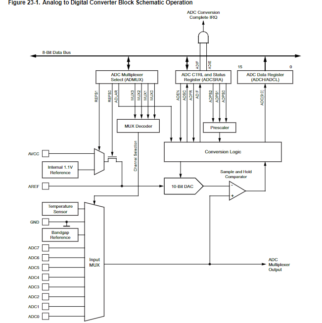
* 아트메가에서 ADC를 수행할려면 아래의 레지스터를 제어해야한다.
* 
* ADMUX
  * 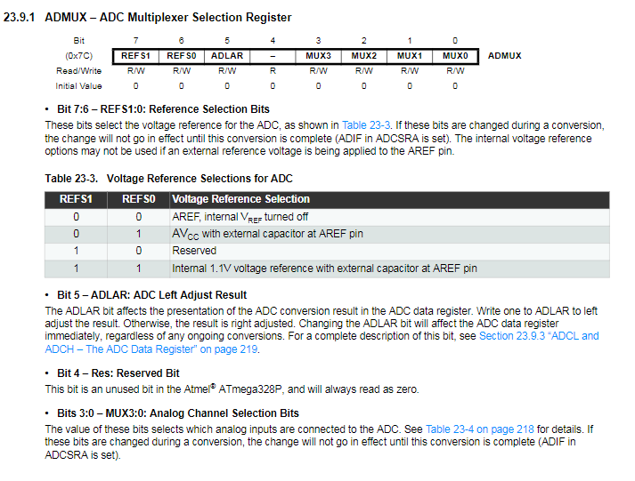
  * 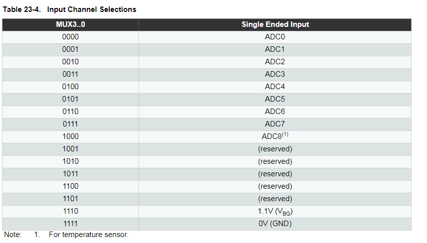
* ADCSRA
  * 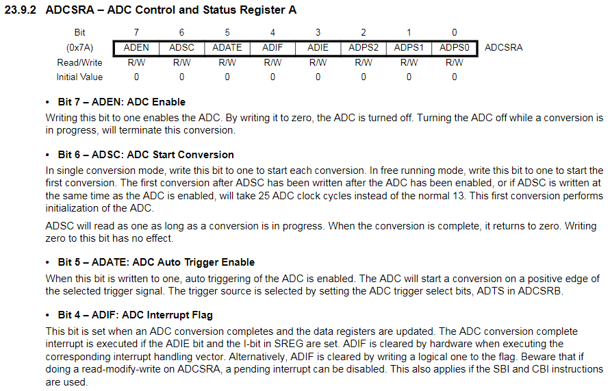
  * 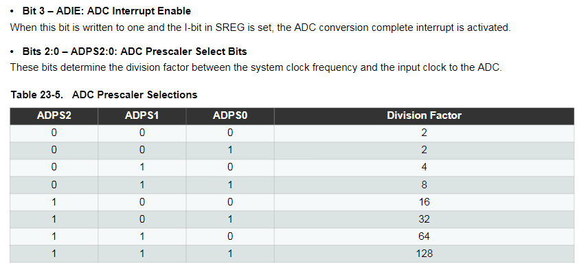
    * 결국 아래의 bit가 중요
    * ADPS0~2 : ADC에 공급할 클럭 설정을 위한 프리스케일러
    * ADEN : ADC Enable
    * ADCS : ADC start conversion
* ADCH/ADCL
  * 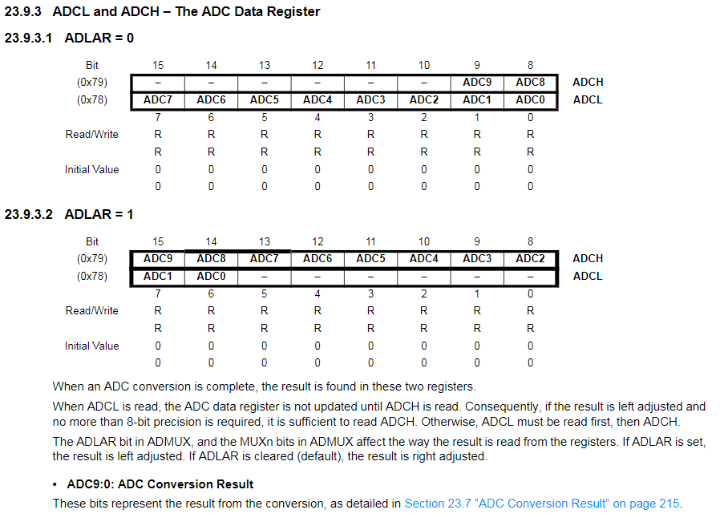
  * 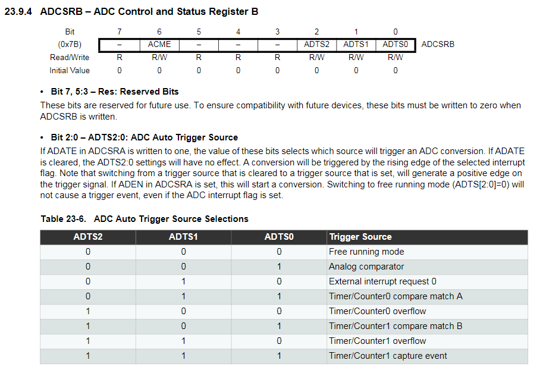
* 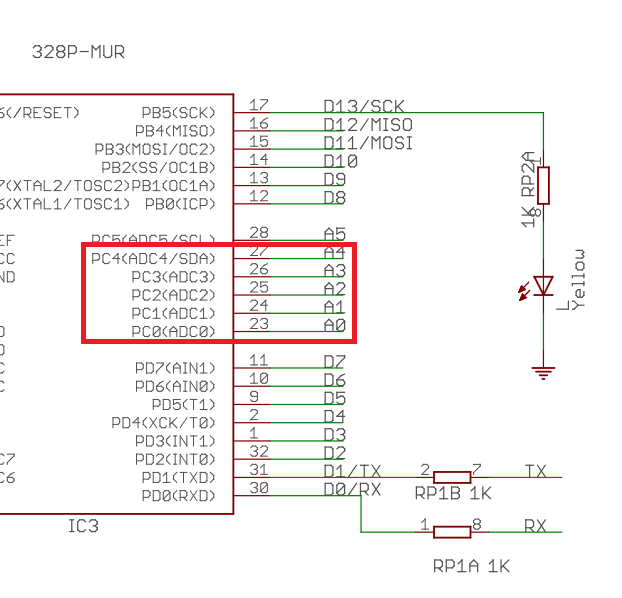

# TIM
* 외부 인터럽트는 애들 보드로 설명하기 솔직히 애매함
* 걍 인터럽트 개념 설명하고 내부 외부가 있다~ 외부는 이렇고~ 내부는 이렇다~ 한뒤에
* 코드는 내부만 ㄲㄲ
* 일단 타이머가 8bit TIM 그리고 16bit TIM가 있음
* 8bit tim은 0~255 / 16bit time 0~65536
* 우린 8-bit T/C TIM0 쓰자
* TIM 모드는 몇개가 있는데 아래 이미지 참고 ㄲㄱ
* 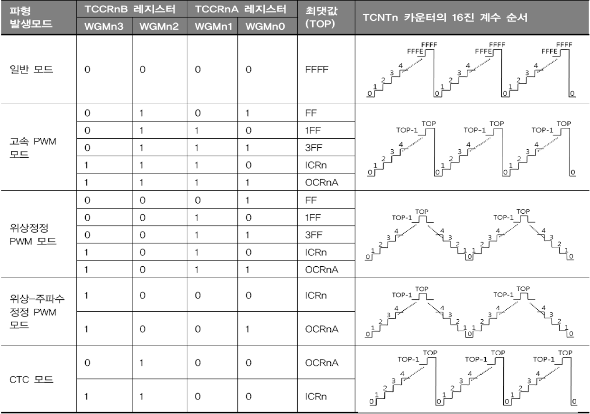
* 우린 CTC모드 쓸꺼임...
* CTC모드가 뭐라면 클럭마다 TCNT가 한개씩 증가함,,,그러다가 OCR 또는 ICR이 일치하면 INT발생  
    -> 여기선 아래의 IRQ 벡터 ㅇㅇ
* 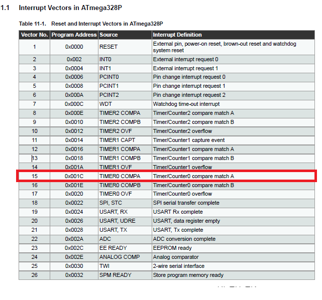
* 왜하필 얘냐면 TIMSK0 떄문임 ㅇㅇ
* 사용해야할 레지스터는 아래와 같음
* 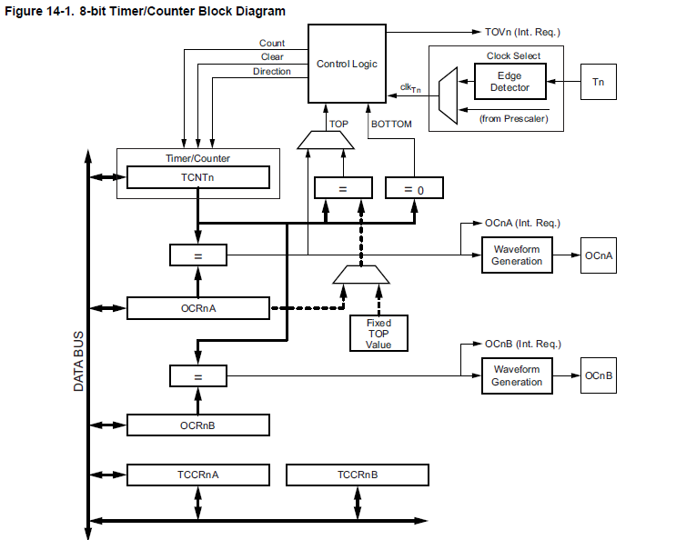
* TCCRA~B / TCNT / OCR / TIMSK0
* TCCRA~B
  * 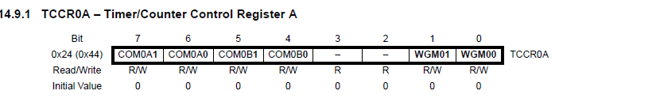
  * 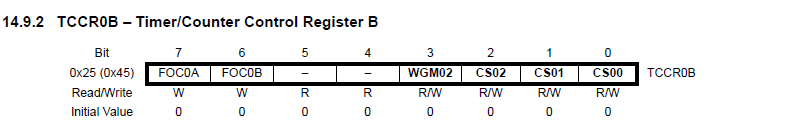
  * 솔직히 얘는 데이터시트보다 아래표가 더 잘 정리되어있음ㅋㅋ
  * 

* TCNT / OCR
  * 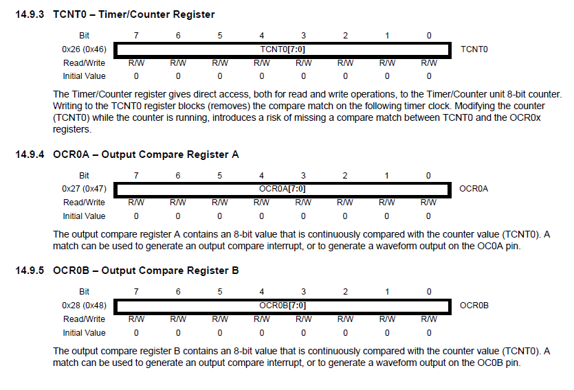
  * TCNT가 결국 클럭이 몇개 지나갔는지 카운트 되는 레지스터 ㅇㅇ
  * OCR은 타겟 벨류 ㅇㅇ
  * CTC모드에서는 결국 TCNT 랑 우리가 셋팅해준 OCR이 맞는지 chk 맞다면 인터럽트 발생
* TIMSK
  * 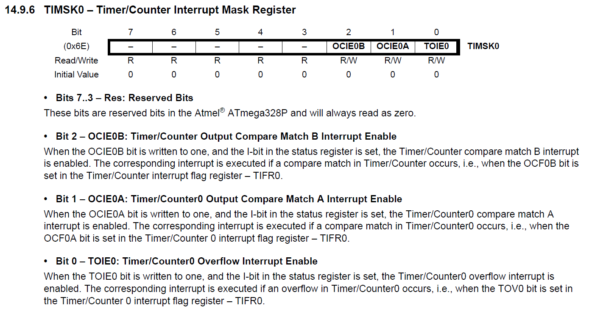
  * OCIE0A를 설정했기 때문에 아래의 INT가 발생한거임 ㅇㅇ
  * 
