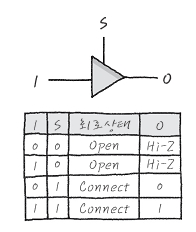

# 2022 RATS MCU 세미나
# Waht is MCU?
* 마이크로컨트롤 유닛의 약자
* 마이크로프로세서 + 외부장치 (EPROM, ADC, SRAM…)
  * 아두이노 우노와 나노는 Atmel 사의 ATmega328 마이크로프로세서 이용
  * 오늘은 328에 방점을 맞춤
* 마이크로프로세서 자체 기능과 외부장치에 따라 수행 가능한 기능이 달라짐!
* 아두이노도 MCU의 한 종류!
* So,,how do we control the device?
  * 모든 장치는 적당한 레지스터에 적다한 값을 집어넣는것.
  * 적당한 레지스터와 적당한 값은 어떻게 아는데? -> 데이터시트에 전부 다 나와있다!
    * Device Driver도 본질적으로 같다.
    * 개발자가 Reg level에서 인터페이싱 하기 어려우니 DD가 개발자가 장치를 파일처럼 다룰 수 있게 reg를 잘 매핑해주는 것.
    * 그리고 reg의 집합이 메모리임...그래서 포인터하고 fseek 같은 함수가 중요한 것 ㅇㅇ

# GPIO (General Purpose Input/Output)
* 
* 말그대로 표준 '입출력' 장치
* 핀명과 병기된 내용은 사용가능한 Altenative function
* 입력
  * 
  * 1.5V 이하의 신호는 LOW
  * 3V 이상의 신호는 HIGH
  * 중간을 비워두는 것은 노이즈 방지를 위함
* 출력
  * HIGH는 5V
  * LOW는 0V
* 어떻게 한 PIN으로 입출력이 가능한가?
  * 
  * 위와 같은 Tri-state Buffer를 이용하여 아래의 회로를 구성한다
  * 
  * 즉, Buffer에 적당한 값을 넣어 입출력모드를 설정할 수 있다.
## Register Level
* 아트메가에서 GPIO를 변경할려면 아래의 레지스터를 제어해야한다.
* DDRx : 입출력 설정
* PORTx : 출력 HIGH / LOW 설정
* PINx : 값 입력4
* 
* 아두이노 내장 LED는 PB5이다.
* 그럼 얘를 제어할려면?
* ```ino
    //일반적인 아두이노 버전
    #define LED_BUILTIN 13
    void setup() {
        pinMode(LED_BUILTIN, OUTPUT);
    }

    void loop() {
        digitalWrite(LED_BUILTIN, HIGH);
        delay(1000);
        digitalWrite(LED_BUILTIN, LOW);
        delay(1000);
    }
  ```
* ```ino
    //레지스터 레벨에서 접근
    void setup(){
        DDRB |= 0x20;
    }
    void loop(){
        PORTB ^= 0x20;
        delay(500);
    }
  ```
# ADC (Analog Digital Converter)
* Analog?
  * 
  * 어떠한 수치가 연속적으로 변하는 물리량으로 나타나는 것
  * 아날로그 형태인 신호를 아날로그 신호라 함
  * 자연에서 얻는 신호는 전부 아날로그 신호
* Digital?
  * 
  * 어떠한 수치가 특정 최소 단위를 가지는 단위로 나타내는 것
  * 디지털 형태인 신호를 디지털 신호
* Analog Digital Converter?
  * 아날로그 신호를 디지털 신호로 변환하는 전자 회로
  * 센서로 받는 아날로그 신호를 MCU에서 사용 할 수 있도록 함
  * 
  * **Sampling Theory**
    * 할지 말지 고민중임.
## Register Level
* ATmega의 ADC회로부 모습이다
* 
* 아트메가에서 ADC를 수행할려면 아래의 레지스터를 제어해야한다.
* ADMUX
  * 
  * 
  * 우리는 5V 기준을 잡는다.
    * 
    * AVCC가 5V이기에 AVCC를 레퍼런스로
* ADCSRA
  * 
  * 
    * 결국 아래의 bit가 중요
    * ADPS0~2 : ADC에 공급할 클럭 설정을 위한 프리스케일러
    * ADEN : ADC Enable
    * ADCS : ADC start conversion
* ADCH/ADCL
  * 
  * 
  * |Frescaler|Value(ADRS2~0)|
    |---------|-----|
    |2        |000  |
    |2        |001  |
    |4        |010  |
    |8        |011  |
    |16       |100  |
    |32       |101  |
    |64       |110  |
    |128      |111  |

* 
  
* ```ino
  void setup() {
    Serial.begin(9600);
    ADMUX |= _BV(REFS0); //Vref = 5V
    ADCSRA |= _BV(ADEN); //AD-conv start
    ADCSRB = 0x00;
  }

  void loop() {
    uint16_t sensorValue = adc_read(7);
    Serial.println(sensorValue);
    delay(1000);
  }

  uint16_t adc_read(uint8_t ch) {
    ADMUX = (ADMUX & 0xF8)|ch;

    ADCSRA |= _BV(ADSC);

    while (ADCSRA & (1 << ADSC)); //wait for conv done!
    ADC = (ADCL | (ADCH << 8));
    return (ADC);
  }
  ```
  * |ADC Channel|Channel Bit|
    |-----------|-----------|
    |ADC0 (A0)  |0000       |
    |ADC1 (A1)  |0001       |
    |ADC2 (A2)  |0010       |
    |ADC3 (A3)  |0011       |
    |ADC4 (A4)  |0100       |
    |ADC5 (A5)  |0101       |
    |ADC6 (A6)  |0110       |
    |ADC7 (A7)  |0111       |
    |ADC8 : 아두이노에선 인터페이싱 X| 1000 |
# Folling
* 내용을 채워주세요...
# INTERRUPT
* 
* 위 상황에서는 PC게임 중이 loop함수
* 위 상황에서는 친구와 영화를 보는 것이 ISR 함수
* INT 처리 순서
  1. loop() 함수 실행
  2. 이벤트 발생 후 인터럽트 함수로 이동(발생 지점 기억)
  3. 인터럽트 함수 실행 보통 ISR(Interrupt Service Routine) 함수로 지칭
  4. ISR 함수 종료 후 기억지점으로 복귀
  5. loop() 함수 계속 실행
* 만약 동시에 INT가 발생한다면?
  * 당연히 우선순위가 존재한다.
  * 
  * 이를 IRQ 벡터 테이블이라고 한다.
* **External Interrupt**
  * 
  * 외부인터럽트란 외부신호에 따라 인터럽트 발생
  * 
  * 아두이노 D2와 D3핀을 이용하면 사용할 수 있다
  * 이번 세미나에서는 실습 생략
* **Internal Interrupt**
  * 상기 언급한 외부인터럽트와 PCINTn를 제외하고는 내부 인터럽트
  * 
  * 예를 들어 Watch Dog TIM를 설명해보자
  * 시스템이 살아있는지 일정 시간 마다 chk하는 것이다.
    * 어떻게?
    * CLK은 일정주기를 가짐.
    * CLK의 펄스를 수 카운트 하고 일정 숫자가 카운트 되면 특정 시간이 지난 것.
    * WDT의 INT가 발생하여 시스템이 살아있는지 chk!
    * 어디에서? 원전과 같은 곳에서 주기적으로 시스템이 살아있는지 체크하기 위해.
  *  Watch Dog TIM는 TIM을 응용한것. TIM에 대해 알아보자

# TIM
* TIM는 CLK의 숫자를 CHK 하여 일정 시간이 지나면 INT를 발생!
  * INT가 발생되면 ISR함수를 실행.
  * 즉, 일정 주기마다 원하는 행위를 수행 가능.
* 
* 328에는 8bit TIM 그리고 16bit TIM가 있음
* 8bit tim은 0-255 / 16bit tim 0-65536 : 이 숫자는 카운트하는 CLK의 갯수임.
* 이번 실습때는 8-bit T/C TIM0 쓰자
* TIM 모드는 몇개 있음
* 
  * 결국에는 CLK가 들어갈떄마다 TCNTn이라는 REG의 숫자가 늘어남.
  * 일반모드
    * TCNTn이 0xFF를 넘어 OVF가 나면 INT가 발생함.
    * TCNTn의 최초 값을 설정하여 주기를 조절함
  * CTC모드 <- 우리가 쓸 기능
    * 일반모드랑 똑같은데 OCRnA 로 Target value를 잡아줌
    * OCR보다 TCNTn 이 커지면 OVF가 나면서 INT 발생
    * OCR로 주기를 조절가능함.
## REG LEVEL
* 상기 언급하였듯이 우린 CTC모드 쓸꺼임...
* CTC모드가 뭐라면 클럭마다 TCNT가 한개씩 증가함,,,그러다가 OCR 또는 ICR이 일치하면 INT발생  
    -> 여기선 아래의 IRQ 벡터 ㅇㅇ
* 
* 왜하필 얘냐면 TIMSK0 떄문임 ㅇㅇ
* 사용해야할 레지스터는 아래와 같음
  * TCCRA~B / TCNT / OCR / TIMSK
* TCCRA~B
  * 
  * 
  * 
  * 솔직히 얘는 데이터시트보다 아래표가 더 잘 정리되어있음ㅋㅋ
  * 
    * CS00~02 REG는 Prescaler를 설정하는 것임.
    * 우리가 쓰는 보드의 CLK는 16MHz
    * 16MHz/OCRn 마다 INT가 발생하면 너무 자주 발생함.
    * Prescaler로 CLK를 분주하여 사용
      * ex) 16MHz의 1024 Prescaler : 16MHz/1024 마다 TCNT 가 증가
      * 결과적으로 16MHz/(1024 * OCR) 마다 INT 발생
  * 위 Table을 보고 적당히 CTC모드에 맞게 레지스터에 값을 써주자

* TCNT / OCR
  * 
  * TCNT가 결국 클럭이 몇개 지나갔는지 카운트 되는 레지스터 ㅇㅇ
  * OCR은 타겟 벨류 ㅇㅇ
  * CTC모드에서는 결국 TCNT 랑 우리가 셋팅해준 OCR이 맞는지 chk 맞다면 인터럽트 발생
* TIMSK
  * 
  * OCIE0A를 설정했기 때문에 아래의 INT가 발생한거임 ㅇㅇ
  * 
* ```ino
    pinMode(13, OUTPUT);
    cli();                      //전역인터럽트 정지

    TCCR0A = 0x0;                 // Reset entire TCCR1A to 0 
    TCCR0B = 0x00;                 // Reset entire TCCR1B to 0
    //일반 모드로 설정

    TCCR0B |= _BV(WGM02)|_BV(CS02)|_BV(CS00);        //프리스케일러 256 / CTC 모드
    TIMSK0 |= _BV(OCIE0A);        //compare match A 인터럽트

    OCR0A = 60;                //타켓 벨류
    sei();                     //전역 인터럽트 설정
  ```
# PWM
* GPIO 제어로 우리는 LED의 불을 끄고 킬 수 있었음.
* 하지만, LED의 밝기를 조절할 수 는 없음.
* LED의 밝기를 조절하기 위해서는 LED에 입력되는 전압을 조절해야함.
* 하지만, 아두이노에는 DAC (Digital Analog Converter)가 없기에 진정한 Analog out은 불가능
* 이를 파훼하기 위해 PWM이 등장
* 
* PWM은 제어 신호의 펄스 폭을 조절하는거임
* 쉽게 말해 스위치를 켰다 껏다를 엄청 빠르게 실시  
  (스위치 ON = 1, 스위치 OFF = 0, 디지털 신호이다)
* 이 껏다 켰다의 비율 (Duty Cycle)을 조절함으로써 LED의 밝기가 달라짐.
* 이로써 아날로그 신호를 묘사 가능함.
* 근데 이거 보면 알겠지만, TIM응용하면 만들 수 있지않을까?
  * TIM은 본질적으로 일정 시간마다 CHK하는 기능
  * PWM은 일정 시간 동안 LOW 그 후 일정 시간동안 HIGH
  * 이것을 반복
  * 완전 TIM으로 구현 가능아님?
* 
* 보면 알겠지만 디지털 신호임. 혼동 ㄴㄴ
* DMM을 찍어보면 아래와 같이 전압이 찍힘 -> 실제로 Vpp가 바뀌는 것은 아님.
  * 100% Duty Cycle : 5V (= 5V * 1)
  * 70% Duty Cycle : 3.5V (= 5V * 0.7)
  * 50% Duty Cycle : 2.5V (= 5V * 0.5)
  * 25% Duty Cycle : 1.25V (= 5V * 0.25)
  * 0% Duty Cycle : 0V (= 5V * 0)
  * **그럼 왜? DMM에는 저렇게 보이는가?**
    * DMM의 처리 속도가 빠르지 않기 때문.
      *  Flukemeter 87V의 ADC만 해도 60Hz정도가 한계.
    * 
    * 대부분의) DMM은 입력단에 위처럼 Low-pass filter를 사용(C18 부분).
    * 따라서 (대부분의 DMM은) AC모드가 아닌한, Vpp대신 평균 전압이 측정. 
    * 만약 실제로 전압이 아날로그하게 바뀐다면, PWM파형 뒷부분에 Resistor-Capacitor 필터를 달아줘 디지털 파형이 아날로그 전압으로 바꾼것.
      * 
## REG LEVEL
* |Timer output|Arduino output|Chip pin|Pin name|
  |------------|--------------|--------|--------|
  |OC0A        |9             |12      |PD6     |
  |OC0B        |5             |11      |PD5     |
  |OC1A        |9             |15      |PB1     |
  |OC1B        |10            |16      |PB2     |
  |OC2A        |11            |17      |PB3     |
  |OC2B        |3             |5       |PD3     |
* 
* 우리 라트 3번 LED는 D5(=PD5)에 결선, 해당 포트는 OC0B(TIM 8BIT COUNTER 0)
* 우선 PWM 모드는 2개가 있음 : 우린 걍 FAST PWM ㄲㄲ
* FAST PWM
  * 
  * TCNTn은 여전히 냅두면 0x00~OCR까지 갔다가 오버플로우되는것을 반복
  * OCRn값과 TCNTn값이 일치하면(비교 매치) OCn핀의 출력값이 바뀜
  * 여기서 출력값이 어떻게 바뀌느냐는 모드마다 다름.
  * 비반전 비교 출력모드(2번째 그림) 경우,
    * HIGH가 출력되다가, 비교 매치에서 OCn핀에 0이 출력.
    * TCNTn이 0xFF에서 0x00으로 떨어질 때 다시 HIGH가 출력.
  * 반전 비교 출력모드(3번째 그림)일 경우
    * LOW가 출력되다가, 비교 매치에서 OCn핀에 1이 출력.
    * TCNTn이 0xFF에서 0x00으로 떨어질 때 다시 LOW가 출력.
* 아까 말했듯이 PWM 은 TIM응용 -> TIM이랑 REG 겹침
* TCNT/OCR/TCCR
* TIM이랑 거의 비슷함
* TCCRA~B
  * 
  * 
  * 

* TCNT / OCR
  * 
  * TCNT가 결국 클럭이 몇개 지나갔는지 카운트 되는 레지스터 ㅇㅇ
  * OCR은 타겟 벨류 ㅇㅇ


* ```ino
  void setup(){
      pinMode(5, OUTPUT);
      TCCR0A = _BV(COM0A1) | _BV(COM0B1) | _BV(WGM01) | _BV(WGM00);
      TCCR0B = _BV(CS02);
  }

  void loop(){
      OCR0B = 128;
      delay(1000);
      OCR0B = 0;
      delay(1000);
  }
  ```
